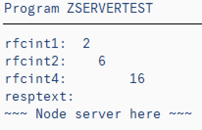
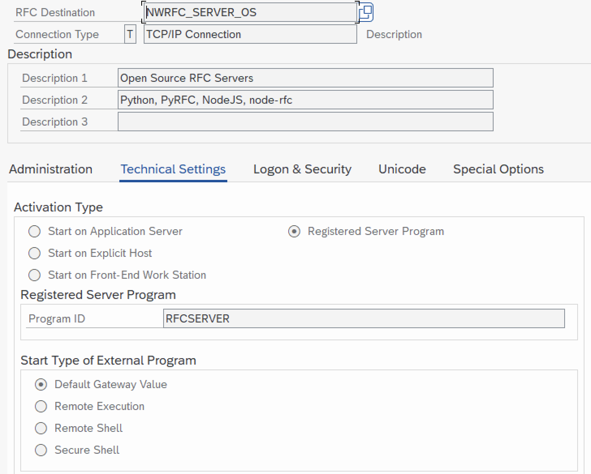

- **[Data Types](#data-types)**
  - [Numeric types](#numeric-types)
  - [Binary types](#binary-types)
  - [Date/Time types](#datetime-types)
  - [UTCLONG](#utclong)
- **[ABAP Function Module](#abap-function-module)**
- **[Addon](#addon)**
  - [setIniFileDirectory](#setinifiledirectory)
  - [reloadIniFile](#reloadinifile)
  - [loadCryptoLibrary](#loadcryptolibrary)
  - [cancelClient](#cancelclient)
  - [languageIsoToSap](#languageisotosap)
  - [languageSapToIso](#languagesaptoiso)
- **[Logging](#logging)**

<a name="client-toc"></a>

- **[Client](#client)**
  - [Using `sapnwrfc.ini` file](api.md/#setIniPath)
  - [Authentication](authentication.md)
    - [Plain with user username/password](authentication.md#plain-with-usernamepassword)
    - [WebSocket RFC](authentication.md#websocket-rfc)
    - [SNC with user PSE](authentication.md#snc-with-user-pse)
    - [SNC with client system PSE and User X509](authentication.md#snc-with-client-system-pse-and-user-x509)
  - [Connection Parameters](#connection-parameters)
  - [Direct and Managed Clients](#direct-and-managed-clients)
  - [Client options](#client-options)
    - [Stateless communication option "stateless"](#stateless-communication-option-stateless)
    - [Decimal data conversion option "bcd"](#decimal-data-conversion-option-bcd)
    - [Date and time conversion options "date" and "time"](#date-and-time-conversion-options-date-and-time)
    - [Parameter type filter option "filter"](#parameter-type-filter-option-filter)
  - [RFC call options](#rfc-call-options)
  - [Error handling](#error-handling)
  - [Invocation patterns](#invocation-patterns)
    - [Async/await](#asyncawait)
    - [Promise](#promise)
    - [Callback](#callback)

- **[Connection Pool](#connection-pool)**
  - [Pool Options](#pool-options)
- **[Closing connections](#closing-connections)**
- **[Cancel connection](#cancel-connection)**

<a name="server-toc"></a>

- **[Server](#server)**
  - [Node.js server program example](#nodejs-server-program-example)
  - [ABAP client call example](#abap-client-call-example)
  - [Server logging](#server-logging)
  - [Configuration](#configuration)
    - [Node server destinations](#node-server-destinations)
    - [ABAP client destinations (sm59)](#abap-client-destinations-sm59)

- **[Throughput](#throughput)**
- **[Environment](#environment)**
- **[Events](#events)**
  - [Client connection cancelled](#client-connection-cancelled)

## Data Types

Node.js data types are automatically converted to ABAP data types and vice versa:

| Node.js to ABAP                | ABAP    | ABAP to Node.js                  | Client Option                                             |
| :----------------------------- | :------ | :------------------------------- | :-------------------------------------------------------- |
| Number                         | INT     | Number                           |                                                           |
| String                         | CHAR    | String                           |                                                           |
| String                         | STRING  | String                           |                                                           |
| Buffer                         | BYTE    | Buffer                           |                                                           |
| Buffer                         | XSTRING | Buffer                           |                                                           |
| **String** \| Function         | DATE    | **String** \| Function           | ["date"](#date-and-time-conversion-options-date-and-time) |
| **String** \| Function         | TIME    | **String** \| Function           | ["time"](#date-and-time-conversion-options-date-and-time) |
| String                         | UTCLONG | String                           |                                                           |
| String                         | NUM     | String                           |                                                           |
| **String** \| Number \| Object | FLOAT   | Number                           |                                                           |
| **String** \| Number \| Object | BCD     | **String** \| Number \| Function | ["bcd"](#decimal-data-conversion-option-bcd)              |
| **String** \| Number \| Object | DECF16  | **String** \| Number \| Function | ["bcd"](#decimal-data-conversion-option-bcd)              |
| **String** \| Number \| Object | DECF34  | **String** \| Number \| Function | ["bcd"](#decimal-data-conversion-option-bcd)              |

References:

- [ABAP built-in numeric types](https://help.sap.com/doc/abapdocu_752_index_htm/7.52/en-US/index.htm?file=abenbuiltin_types_numeric.htm)

- [JavaScript Number Objects](https://www.ecma-international.org/ecma-262/#sec-number-objects)

- [Min/max values](https://github.com/SAP/node-rfc/blob/master/test/testutils/config.js)

### Numeric types

ABAP built-in numeric types are mapped to JavaScript Number Objects.

Binary ABAP float type, FLOAT, is converted to Node.js Number Object. Number, String, or Number Object can be sent from Node.js to ABAP.

Decimal ABAP float types, BCD, DECF16 and DECF34, are represented as Node.js Strings by default.

Optionally represented as the Number Object, or custom decimal number object like [Decimal](https://github.com/MikeMcl/decimal.js/), see [client option "bcd"](#decimal-data-conversion-option-bcd).

### Binary types

ABAP binary types, BYTE and XSTRING, are mapped to Node.js Buffer objects.

### Date/Time types

ABAP date and time types, DATS and TIMS, are character types in ABAP, represented as Node.js String by default.

Optionally represented as custom Date/Time objects, see [client options "date" and "time"](#date-and-time-conversion-options-date-and-time).

### UTCLONG

ABAP UTCLONG type is mapped to Node.js string, with initial value `0000-00-00T00:00:00.0000000`.

## ABAP Function Module

Remote enabled ABAP function modules (RFM) parameters can be ABAP variables, structures and tables.

ABAP variables are mapped to Node.js variables, ABAP structures to Node.js objects (simple key-value pairs) and ABAP tables to Node.js arrays of objects, representing ABAP structures.

Taking ABAP RFM `STFC_STRUCTURE` as example, we see four parameters:

```abap
FUNCTION STFC_STRUCTURE.
*"----------------------------------------------------------------------
*"*"Lokale Schnittstelle:
*"       IMPORTING
*"             VALUE(IMPORTSTRUCT) LIKE  RFCTEST STRUCTURE  RFCTEST
*"       EXPORTING
*"             VALUE(ECHOSTRUCT) LIKE  RFCTEST STRUCTURE  RFCTEST
*"             VALUE(RESPTEXT) LIKE  SY-LISEL
*"       TABLES
*"              RFCTABLE STRUCTURE  RFCTEST
*"----------------------------------------------------------------------
```

| Parameter name | Direction    | Parameter type |
| :------------- | :----------- | :------------- |
| IMPORTSTRUCT   | to ABAP      | structure      |
| ECHOSTRUCT     | from ABAP    | structure      |
| RESPTEXT       | from ABAP    | variable       |
| RFCTABLE       | to/from ABAP | table          |

Using ABAP transaction SE37 in ABAP backend system, you can enter the input data, run the function module and inspect results.

To consume this function module from Node.js, first the node-rfc client connection shall be instantiated, using ABAP backend system connection parameters.

## Addon

API: [api/addon](api.md#addon)

### setIniFileDirectory

Sets the directory in which the NWRFC SDK shall search for the `sapnwrfc.ini` file, exposing the `RfcSetIniPath` NWRFC SDK method. The default is the current working directory of the process. After the directory is set, the NW RFC lib automatically loads the contents of the new `sapnwrfc.ini` file from that directory. The exception is thrown if `sapnwrfc.ini` not found in the new directory.

```ts
const noderfc = require("node-rfc");
noderfc.setIniFileDirectory("/some/folder");
```

### reloadIniFile

Reloads the contents of the `sapnwrfc.ini` file into memory.

Searches the directory given by `RfcSetIniPath()` (or the current working directory)
for the file `sapnwrfc.ini` and loads its contents into memory. Reloading the `sapnwrfc.ini`
file is only necessary after the file has been manually edited.
If you want to use a `sapnwrfc.ini` file in a different location, consider using `setIniFileDirectory()`.

Note: If a file with the name `sapnwrfc.ini` does not exist in the given directory,
this is not considered an error! Default settings are used in this case.

```ts
const noderfc = require("node-rfc");
try{
noderfc.reloadIniFile();
} catch (ex) {
    console.log(ex);
}
```

### loadCryptoLibrary

Sets the absolute path to the sapcrypto library to enable TLS encryption via Websocket RFC.

The parameter pathToLibrary needs also to contain the name of the library. This function has the same effect as the `sapnwrfc.ini` parameter TLS_SAPCRYPTOLIB. This API cannot reset a new path to the library during runtime. Once set, the path is definitive.

```ts
const noderfc = require("node-rfc");
noderfc.loadCryptoLibrary("/usr/local/sap/cryptolib/libsapcrypto.so");
```

### cancelClient

API: [api/client](api.md#cancelclient)

Cancels ongoing RFC call, see also: [Cancel connection](#cancel-connection)

```ts
const noderfc = require("node-rfc");
noderfc.cancelClient(client);
```

### languageIsoToSap

API: [api/addon](api.md#languageisotosap)

Conversion of language ISO code to 1-digit SAP code

```ts
const noderfc = require("node-rfc");
const langSAP = noderfc.languageIsoToSap("EN");
```

### languageSapToIso

API: [api/addon](api.md#languagesaptoiso)

Conversion of language 1-digit SAP code to ISO code

```ts
const noderfc = require("node-rfc");
const langSAP = noderfc.languageSapToIso("E");
```

## Client

API: [api/client](api.md#client)

Using the client instance, ABAP RFMs can be consumed from Node.js. The client constructor requires
[connection parameters](#connection-parameters) to ABAP backend system and, optionally, [client options](#client-options).

### Connection Parameters

Connection parameters are provided as simple Node.js object. The complete list of supported parameters is given in `sapnwrfc.ini` file, located in SAP NWRFC SDK `demo` folder.

```javascript
const abapConnection = {
    user: "demo",
    passwd: "welcome",
    ashost: "10.68.110.51",
    sysnr: "00",
    client: "620",
    lang: "EN",
};
```

Connection parameters can be also read from `sapnwrfc.ini` file, located in a current folder or at path set in `RFC_INI` environment variable (including the filename). Only the destination parameter is required:

```javascript
const abapConnection = {
    dest: "QI3",
};
```

**sapnwrfc.ini**

```ini
DEST=QI3
USER=demo
PASSWD=welcome
ASHOST=10.68.110.51
SYSNR=00
CLIENT=620
LANG=EN
#TRACE=3
```

```shell
$ echo $RFC_INI
./sapnwrfc.ini
```

### Direct and Managed Clients

The type of client connection can be managed (by the Connection Pool) or direct, without using Connection Pool.

The direct client is instantiated with closed connection:

```node
const connParams = { dest: "QI3" };
const Client = require("node-rfc").Client;
const client = new Client(connParams);
console.log(client.alive); // false
```

Managed client is instantiated with open connection:

```node
const Pool = require("node-rfc").Pool;
const pool = new Pool({ connectionParameters: connParams });
pool.acquire((client) => {
    console.log(client.alive); // true
});
```

An open connection is represented by unique `RFC_CONNECTION_HANDLE` pointer, assigned by SAP NWRFC SDK and exposed as a client [`connectionHandle`](api.md#getters) getter. The value of this property is zero, when the connection is closed. The client getter [`alive`](api.md#getters) is set to true, if the value is non-zero, representing an open connection.

Direct clients have access to connection [`open()`](api.md#open) and [`close()`](api.md#close) methods and each call to[`open()`](api.md#open) method will set the new [`connectionHandle`](api.md#getters)value. After the connection is closed, the[`connectionHandle`](api.md#getters) is set to zero but new opened connection can get the same [`connectionHandle`](api.md#getters) value, as the previously closed connection. The handle is just the pointer to the C ++ object and after a free / delete operation the C-Runtime can re-use the same address again in a subsequent malloc / new. It happens very often (especially on Windows), that memory management system “notices” the block of memory is just the right size and the block is re-used, instead of allocating a new one, causing unnecessary fragmentation. The [`connectionHandle`](api.md#getters) can therefore change during the direct client instance lifecycle and more client instances may get the same[`connectionHandle`](api.md#getters), not at the same time. If not synchronized properly, the delayed direct client [`close()`](api.md#close) call, can close the handle already assigned to another client instance, typically causing the `RFC_INVALID_HANDLE` errors when that client tries to make the RFC call.

This situation may happen when the `node-rfc` is consumed by multi-threaded nodejs modules, like `express` for example, when application typically can't influence the sequence of concurrent requests` execution.

Using [Connection Pool](#connection-pool) is reccomended in such scenarios.

### Client options

Using client options, passed to Client or Pool constructor, the default client behaviour can be modified:

| Option      | Description                                                                                              |
| ----------- | -------------------------------------------------------------------------------------------------------- |
| `stateless` | Stateless connections, default **false**                                                                 |
| `bcd`       | Decimal numbers conversion: [Numeric types](#numeric-types)                                              |
| `date`      | Dates conversion: [Date/Time types](#datetime-types)                                                     |
| `time`      | Times of day conversion: [Date/Time types](#datetime-types)                                              |
| `filter`    | Result parameter types' filtering                                                                        |
| `timeout`   | RFC call will be cancelled after `timeout` given in seconds. See [Cancel connection](#cancel-connection) |

#### Stateless communication option "stateless"

When set to `true`, the `RfcResetServerContext()` is automatically executed after each RFM call from `node-rfc`. It can be also executed any time, by calling the client `resetServerContext()` method.

[SAP NetWeaver RFC SDK ProgrammingGuide](https://support.sap.com/en/product/connectors/nwrfcsdk.html):

SAP Java Connector (JCo 3.1) and SAP .NET Connector (NCo 3.0) are stateless by default and you have to put some effort into it, if you need a stateful connection.

SAP NWRFC SDK and hence the `node-rfc` is statefull by default, which makes calling an Update-BAPI or some other RFM that stores intermediate results in the current user’s ABAP session memory very easy. For example, the program just calls the BAPI or function module, and if it succeeds, just calls
BAPI_TRANSACTION_COMMIT on the same connection, and it will run inside the same user session in the backend.

However, there are also situations, where the business logic needs a stateless connection, for example, if you have just called a function module that stored a lot of data in the ABAP session memory, you now want to call further RFMs in the same user session, and the leftover data from the previous call is now superfluous garbage that is no longer needed, which degrades the performance, or – even worse – causes unwanted side effects for the following call(s).

Of course, the application could simply close the connection and open a fresh one, which also creates a fresh ABAP user session, but this could be a bit time and resource consuming, especially when an SNC handshake must be performed during login. In this case it is easier to just use the API function `RfcResetServerContext()`. This function cleans up any user session state in the backend, but keeps the connection and the user session alive.

#### Decimal data conversion option "bcd"

With `bcd`, set to `number`, or to conversion function like [Decimal](https://github.com/MikeMcl/decimal.js/), decimal ABAP float types, BCD, DECF16 and DECF34 are represented as Number object or custom decimal number object.

:exclamation: Using `number` option is **not recommended** here, can lead to rounding errors during ABAP to Node.js conversion.

```javascript
let clientOptions = {
    bcd: "string",
    // bcd: require("decimal.js"),
};
```

#### Date and time conversion options "date" and "time"

The client option `date` shall provide `fromABAP()` function, for ABAP date string (YYYYMMDD) conversion to Node.js date object and the `toABAP()` function, for the other way around.

3rd party libraries like [Moment](https://momentjs.com/) or standard JavaScript Date Object can be used, like shown below:

```javascript
const clientOptions = {
    date: {
        // Node.js Date() to ABAP YYYYMMDD
        toABAP: function (date) {
            if (!(date instanceof Date))
                return new TypeError(`Date object required: ${date}`);
            let mm = date.getMonth() + 1;
            let dd = date.getUTCDate();
            return [
                date.getFullYear(),
                mm > 9 ? mm : "0" + mm,
                dd > 9 ? dd : "0" + dd,
            ].join("");
        },

        fromABAP: function (dats) {
            // ABAP YYYYMMDD to Node.js Date()
            return new Date(
                0 | dats.substring(0, 4),
                (0 | dats.substring(4, 6)) - 1,
                (0 | dats.substring(6, 8)) + 1
            );
        },
    },
};
```

#### Parameter type filter option "filter"

Using the `filter` options, certan ABAP parameter types can be removed from RFM call result JavaScript object, reducing the data volume.

Supported values are described in `sapnwrfc.h` file, located in SAP NWRFC SDK `include` folder:

```c++
typedef enum _RFC_DIRECTION
{
  RFC_IMPORT   = 0x01,                    ///< Import parameter. This corresponds to ABAP IMPORTING parameter.
  RFC_EXPORT   = 0x02,                    ///< Export parameter. This corresponds to ABAP EXPORTING parameter.
  RFC_CHANGING = RFC_IMPORT | RFC_EXPORT, ///< Import and export parameter. This corresponds to ABAP CHANGING parameter.
  RFC_TABLES   = 0x04 | RFC_CHANGING      ///< Table parameter. This corresponds to ABAP TABLES parameter.
}RFC_DIRECTION
```

```javaScript
clientOptions = {
    filter: 1 // Import parameters not copied to result object
}
```

### RFC call options

RFC call options can be provided for each particular RFC call:

- `notRequested`
- `timeout`

#### notRequested

ABAP remote-enabled function module can have many parameters but ABAP client calling the RFM may request only a few. When called by ABAP client, the ABAP RFM "knows" which parameters are requested and can skip processing and return of non-requested parameters. When called by non-ABAP client, not-requested parameters can be explicitely provided as array of parameters' names.

```ts
const notRequested = [
  "ET_COMPONENTS",
  "ET_HDR_HIERARCHY",
  "ET_MPACKAGES",
  "ET_OPERATIONS",
  "ET_OPR_HIERARCHY",
  "ET_PRTS",
  "ET_RELATIONS",
];
client.call(
  "EAM_TASKLIST_GET_DETAIL",
  {
    IV_PLNTY: "A",
    IV_PLNNR: "00100000",
  },
  {
    notRequested: notRequested,
  }
).then( ...
```

#### timeout

See [Cancel connection](#cancel-connection)

RFC call timeout overrides the client options timeout.

```ts
client.call(
  "EAM_TASKLIST_GET_DETAIL",
  {
    IV_PLNTY: "A",
    IV_PLNNR: "00100000",
  },
  {
    timeout: 5,
  }
).then( ...
```

### Error Handling

Three types of errors can be returned to Node.js application:

- JavaScript exceptions, thrown when wrong parameters are provided to `Client`, `Pool` or `Throughput` constructor
- Error objects from NWRFC SDK, like logon error or calling a non-existing RFM
- Error objects from node node-rfc, like catching a string passed from Node.js to ABAP RFM integer parameter field

After certain critical errors, the connection can be automatically re-opened: **[Closing connections](#closing-connections)**.

Error object is returned as Promise rejection or first callback parameter (callback pattern).

When error is related to RFM parameter field, the `rfmPath` object is attached to error object, describing the affected field location:

```node
const good = { RFCINT1: 1 };
const BAD = { RFCINT1: "1" };

client.invoke(
    "STFC_STRUCTURE",
    {
        RFCTABLE: [good, good, good, BAD, good],
    },
    (err, res) => {
        if (err) console.error("error:", err);
        //error: {
        //  name: 'nodeRfcError',
        //  message: 'Integer number expected from Node.js for the field of type 10',
        //  rfmPath: {
        //    rfm: 'STFC_STRUCTURE',
        //    parameter: 'RFCTABLE',
        //    table: 'RFCTABLE',
        //    table_line: 3,
        //    field: 'RFCINT1'
        //  }
        //}
    }
);
```

#### Error types, codes, groups, and classes

[Schmidt and Li (2009a)](http://sap.github.io/PyRFC/bibliography.html#c09a) describe five error types
on the basis of the return code (i.e. error code), returned from NWRFC SDK:

- Communication failure
- Logon failure
- System failure
- ABAP exception
- ABAP messages

There are in total roughly 30 possible return codes that indicate some kind of error. Error information returned
from NWRFC SDK provides an `error group`, taken as the basis for two exception classes, shown in a below table.
The `node-rfc` is using one exception class and exception class names are exposed as error object `name` property:

| type (SPJ)            | code [numeric](C)             | group (C)                | Error Object `name` |
| --------------------- | ----------------------------- | ------------------------ | ------------------- |
| Communication failure | [1] RFC_COMMUNICATION_FAILURE | COMMUNICATION_FAILURE    | RfcLibError         |
| Logon failure         | [2] RFC_LOGON_FAILURE         | LOGON_FAILURE            | RfcLibError         |
| System failure        | [3] RFC_ABAP_RUNTIME_FAILURE  | ABAP_RUNTIME_FAILURE     | AbapError           |
| ABAP message          | [4] RFC_ABAP_MESSAGE          | ABAP_RUNTIME_FAILURE     | AbapError           |
| ABAP exception        | [5] RFC_ABAP_EXCEPTION        | ABAP_APPLICATION_FAILURE | AbapError           |
| node-rfc error        |                               |                          | nodeRfcError        |

### Invocation patterns

After getting a direct or managed client instance, the ABAP function module can be consumed from Node.js using Async/await, Promise or callback pattern.

#### Async/await

```javascript
(async function () {
    try {
        await client.open();

        const importStruct = {
            RFCINT4: 345,
            RFCFLOAT: 1.23456789,
            RFCCHAR4: "ABCD",
            RFCDATE: "20180625",
        };

        let result = await client.call("STFC_STRUCTURE", {
            IMPORTSTRUCT: importStruct,
        });

        console.log(result.RESPTEXT);
    } catch (ex) {
        console.error(ex);
    }
})();
```

#### Promise

```javascript
client
    .open()
    .then(() => {
        let importStruct = {
            RFCINT4: 345,
            RFCFLOAT: 1.23456789,
            RFCCHAR4: "ABCD",
            RFCDATE: "20180625",
        };
        client
            .call("STFC_STRUCTURE", { IMPORTSTRUCT: importStruct })
            .then((result) => {
                console.log(result.RESPTEXT);
            })
            .catch((err) => {
                console.error("could not complete ABAP RFM call", err);
            });
    })
    .catch((err) => {
        console.error("could not connect to server", err);
    });
```

#### Callback

```javascript
// open connection
client.connect(function (err) {
    if (err) {
        // abort if login/connection errors
        return console.error("could not connect to server", err);
    }

    // invoke the function module
    const importStruct = {
        RFCINT4: 345,
        RFCFLOAT: 1.23456789,
        RFCCHAR4: "ABCD",
        RFCDATE: "20180625",
    };

    client.invoke(
        "STFC_STRUCTURE",
        { IMPORTSTRUCT: importStruct },
        (err, result) => {
            if (err) {
                return console.error("Error invoking STFC_STRUCTURE:", err);
            }

            console.log(
                "STFC_STRUCTURE call result", Object.keys(result))
            );
        }
    );
});
```

## Connection Pool

API: [api/pool](api.md#connection-pool)

Connection Pool provides managed clients, which can't close or open their own connections. Their access to [`close()`](api.md#close) and [`open()`](api.md#open) methods is disabled and only the pool can open and close connections. The [`connectionHandle`](api.md#getters) of the managed client is therefore constant, changed only after critical errors, leading to connection close ( see [Closing connections](#closing-connections)). The managed client acquires an open connection from the Connnection Pool, using [`acquire()`](api.md#acquire) method and after no more needed, returns it back to pool, using [`release()`](api.md#release-1) method. After getting the connection back, the Connection Pool can reset the context and keep it open, ready for the next client, or close the connection. If the number of ready connections is less than pool `high` threshold parameter, the returned connection is added to ready connections, otherwise closed. The `low` threshold parameters defines a minimum number of connections, the Pool should keep open, ready for clients:

```node
const pool = new Pool({
    connectionParameters: connParams,
    clientOptions: {}, // optional
    poolOptions: { low: 2, high: 4 }, // optional
});
```

Using [ready()](api.md#ready) method, the number of ready connections can be increased, ignoring the `ready_high`:

```node
pool.ready(5).then(() => {
    // 5 ready connections
});
```

### Pool Options

`low` is the minimum number of connections to keep open, accelerating client `acquire()` requests. **Default**: `2`.

`high` is the maximum number of connections to keep open, "recycling" returned client connections. **Default**: `4`.

## Closing connections

The direct connection is closed by calling the client [`close()`](api.md#close) method or automatically, by client destructor.

The managed connection is returned to Connection Pool, using [`release()`](api.md#release-1) method and can be closed or reused by Connection Pool.

Connection Pool ready and leased connections are closed by Pool destructor.

The direct and managed connection can be automatically closed, if critical error occurs during the communication with ABAP backend system.
The client [`connectionHandle`](api.md#getters) property is set to NULL and `alive` to `false`. Critical error conditions,
leading to connection close, are exposed in `errorInfo` object.

If any of errors below occur, the client connection is not considered useful any more. The connection is automatically re-opened and
in case re-open error, that error is returned as a result. The new connection handle is assigned to the client and, if the client
is managed, the pool leased connections set is updated.

| errorInfo | Value                     | Description                                                                                                 |
| --------- | ------------------------- | ----------------------------------------------------------------------------------------------------------- |
| code      | RFC_COMMUNICATION_FAILURE | Error in Network & Communication layer.                                                                     |
| code      | RFC_ABAP_RUNTIME_FAILURE  | SAP system runtime error (SYSTEM_FAILURE): Shortdump on the backend side.                                   |
| code      | RFC_ABAP_MESSAGE          | The called function module raised an E-, A- or X-Message.                                                   |
| code      | RFC_EXTERNAL_FAILURE      | Error in external custom code. (E.g. in the function handlers or tRFC handlers.) Results in SYSTEM_FAILURE. |
| group     | ABAP_RUNTIME_FAILURE      | ABAP Message raised in ABAP function modules or in ABAP runtime of the backend (e.g Kernel)                 |
| group     | LOGON_FAILURE             | Error message raised when logon fails                                                                       |
| group     | COMMUNICATION_FAILURE     | Problems with the network connection (or backend broke down and killed the connection)                      |
| group     | EXTERNAL_RUNTIME_FAILURE  | Problems in the RFC runtime of the external program (i.e "this" library)                                    |

## Cancel connection

Ongoing RFC call can be cancelled when running too long for example

- Explicitely, by calling `cancel()` method, exposed at addon, client and pool level
- By timeout provided in [client options](#client-options) or [RFC call options](#rfc-call-options). RFC call timeout overrides the client timeout.

In either case, the `sapnwrfc:cancel` event is raised

- More info: [Event: Client connection cancelled](#client-connection-cancelled)
- Examples: [SAP/node-rfc-samples/clientConnectionCancel](https://github.com/SAP-samples/node-rfc-samples/tree/main/integration/clientConnectionCancel)

Function call:

```node
const client = await pool.acquire();

try {
const result = await client
        .call("RFC_PING_AND_WAIT", {
            SECONDS: N,
        })
} catch (err) {
    // raised when cancellation called:
    // {
    //    name: 'RfcLibError',
    //    group: 4,
    //    code: 7,
    //    codeString: 'RFC_CANCELED',
    //    key: 'RFC_CANCELED',
    //    message: 'Connection was canceled.'
    // }
}
```

### Explicit cancel

```node
await client.cancel();
await pool.cancel(client);
await addon.cancelClient(client);
```

Client with `timeout` client option will cancel all RFC calls taking longer than N seconds:

```node
const client = new Client {dest: "XYZ", {timeout: N}}
```

### Cancel by timeout

The `timeout` option can be provided also for at RFC call level, overriding the client `timeout`:

```node
const client = new Client {dest: "XYZ", {timeout: 3}}

// A single RFC call can tolerate a longer duration
const result = await client.call("BAPI_USER_GET_DETAIL", {USERNAME: "DEMO"}, {timeout: 5});

// or shorter
const result = await client.call("BAPI_USER_GET_DETAIL", {USERNAME: "DEMO"}, {timeout: `});

```

<a name="server"></a>

## Server

API: [api/server](api.md#server)

Blog: [Call Node.js or Python Functions from ABAP](https://blogs.sap.com/2023/08/25/call-node.js-or-python-functions-from-abap/)

Using the node-rfc Server bindings, Node.js functions can be exposed as ABAP functions on Node.js system and consumed by ABAP client, using `CALL FUNCTION DESTINATION` ABAP statement.

To make Node.js function available for ABAP clients, the NodeJS function name must be mapped to valid ABAP function name (max 30 char long) that ABAP client can call. Also the description of ABAP function parameters must be provided (function description), in binary format, that ABAP client shall use to send and receive the data.

The ABAP function name is therefore not any name but the name of existing function module in ABAP system.This ABAP function can be already existing one, or new created empty function module, just for node-rfc Server function definition.

In following example the node-rfc server will expose two JS functions using function definitions of already existing ABAP function modules. The `my_stfc_connection` JS function is exposed as ABAP `STFC_CONNECTION` function module and `my_stfc_structure` as ABAP `STFC_STRUCTURE` function module.

The first JS function returns promise and the second one data value. Here is the example full source code:

- ABAP client reports
  - [zserver_stfc_connection.abap](../examples/zserver_stfc_connection.abap)
  - [zserver_stfc_structure.abap](../examples/zserver_stfc_stucture.abap)
- Server: [server.mjs](../examples/server.mjs)
- Log: [_noderfc.log](../examples/_noderfc.log)

and here the key points.

### Node.js server program example

```ts
import { RfcLoggingLevel, Server } from "node-rfc";

// Create server instance
const server = new Server({
  clientConnection: { dest: "MME" },
  serverConnection: { dest: "MME_GATEWAY" },
  // Server options are not mandatory
  serverOptions: {
    logLevel: RfcLoggingLevel.info,
  },
});

// Define server function
function my_stfc_structure(request_context, abap_input) {
  return {
    ECHOSTRUCT: {RFCINT1: 2, RFCINT2: 6, RFCINT4: 16},
    RESPTEXT: `~~~ Node server here ~~~`
  }
}

(async () => {
  try {
    // Register my_stfc_structure as ABAP STFC_STRUCTURE function module
    await server.addFunction("STFC_STRUCTURE", my_stfc_structure);

    // Start the server
    await server.start();

  } catch (ex) {
      // Catch errors, if any
      console.error(ex);
  }
})();

// Close the server after 10 seconds - not for production!
let seconds = 10;
const tick = setInterval(() => {
  console.log("tick", --seconds);
  if (!seconds > 0) {
    server.stop(() => {
      clearInterval(tick);
      console.log("bye!");
    });
  }
}, 1000);
```

### ABAP client call example

```abap
call function 'STFC_STRUCTURE' destination 'NWRFC_SERVER_OS'
  exporting
    importstruct = ...
```

Result



### Server logging

When activated the logging is save in `_noderfc.log` file in current working directory

### Configuration

The ABAP system configuration for non-ABAP RFC server is described in chapter "5 RFC Server Programs" of **[SAP NWRFC SDK 7.50 Programming Guide](https://support.sap.com/content/dam/support/en_us/library/ssp/products/connectors/nwrfcsdk/NW_RFC_750_ProgrammingGuide.pdf)**

For this particular example, the configuration includes the two sets of ABAP RFC connection parameters, the  `clientConnection` and `serverConnection`, as per our example:

```ts
const server = new Server({
  clientConnection: { dest: "MME" },
  serverConnection: { dest: "MME_GATEWAY" },
```

The client connection is required for fetching ABAP functions' definitions, not necessarily from the same system, from which the ABAP client shall call Node.js server.

The server connection is required for ABAP client to call Node.js server and may look like

#### Node server destinations

```ini
DEST=MME
USER=(redacted)
PASSWD=(redacte)
#ASHOST=coevi51
ASHOST=10.68.110.51
SYSNR=00
CLIENT=620
LANG=EN
TRACE=0

DEST=MME_GATEWAY
GWSERV=sapgw00
GWHOST=coevi51
PROGRAM_ID=RFCSERVER
REG_COUNT=1
```

#### ABAP client destinations (sm59)

The Node.js destination is in SM59 looks like



## Throughput

API: [api/throughput](api.md#throughput)

The Throughput object can be attached to one or more clients, providing the RFM communication monitoring:

- number of calls
- sent bytes
- received bytes
- application time
- total time
- serialization time
- deserialization time

## Environment

The `environment` object provides info on node-rfc, SAP NWRFC SDK and Node.js platform.

It is exposed at package level, replicated at Pool and Client class and instance levels:

```shell
$ node -p "require('node-rfc')".environment         # binding
$ node -p "require('node-rfc')".Pool.environment    # class
$ node -p "require('node-rfc')".Client.environment  # class
$ node -p "new (require('node-rfc').Client)({dest: 'MME'}).environment" # instance
$ node -p "new (require('node-rfc').Pool)({connectionParameters: {dest: 'MME'}}).environment" # instance
{
    platform: { name: "darwin", arch: "x64", release: "19.5.0" },
    env: { SAPNWRFC_HOME: "/usr/local/sap/nwrfcsdk", RFC_INI: "" },
    noderfc: {
        version: "2.0.0",
        nwrfcsdk: { major: 7500, minor: 0, patchLevel: 5 },
    },
    versions: {
        node: "14.4.0",
        v8: "8.1.307.31-node.33",
        uv: "1.37.0",
        zlib: "1.2.11",
        brotli: "1.0.7",
        ares: "1.16.0",
        modules: "83",
        nghttp2: "1.41.0",
        napi: "6",
        llhttp: "2.0.4",
        openssl: "1.1.1g",
        cldr: "37.0",
        icu: "67.1",
        tz: "2019c",
        unicode: "13.0",
    },
}
```

## Events

### Client connection cancelled

Sent when client connection is cancelled, explicitely or by timeout.

```ts
import { Client, sapnwrfcEvents } from "node-rfc";

sapnwrfcEvents.on("sapnwrfc:clientCancel", (data) =>
    console.log("event", data)
);
// event { id: 1, connectionHandle: 140576595093504 }

```

## Logging

Logging can be activated by Client, Pool or Server option `logLevel`, like:

```node
const client = new Client(
    { dest: "MME" },
    {logLevel: RfcLoggingLevel.error });

const pool = new Pool({
  connectionParameters: { dest: "MME" },
  poolOptions: { logLevel: RfcLoggingLevel.error },
});

const server = new Server({
  serverConnection: { dest: "MME_GATEWAY" },
  clientConnection: { dest: "MME" },
  serverOptions: {
    logLevel: RfcLoggingLevel.debug,
  },
});
```

The default log file name is `_noderfc.log`, in current working directory. The different log file name and destination can be set by invoking addon method `setLogFilePath()`, like:

```node
addon.setLogFilePath("/usr/local/tmp/mylogfile.log");
```
