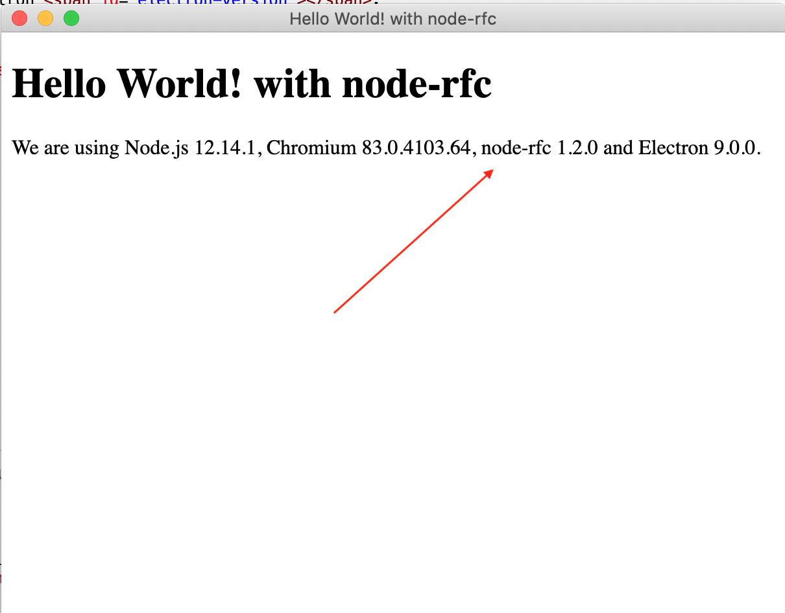

## node-rfc and electron-quick-start

Minimal Electron example, based on the [electron-quick-start](https://github.com/electron/electron-quick-start) app.

Changes: be2240e

```bash
# Go into the repository
cd electron-quick-start
# Install dependencies
npm install
# Run the app
npm start
```


